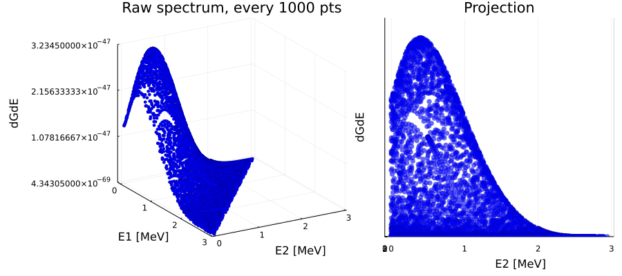
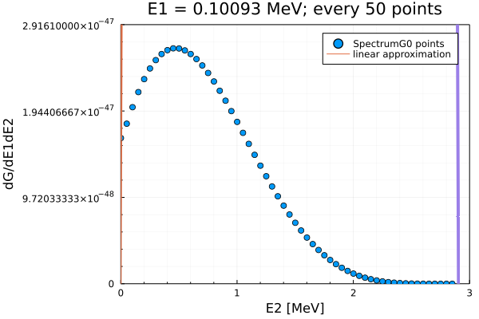
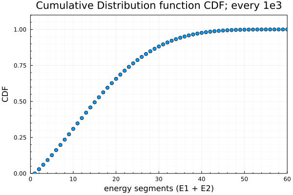

## Example of how to use the MPRebinSpectra module. 
### A discrete 2D spectrum of electron energies (for $2\nu\beta\beta$ decay) is given as an ascii text file where:
    column1 = E1, column2 = E2, column3 = multiplicity(dGdE)

The premise of MPRebinSpectra module is the use of segmential linear approximation of the discrete spectral points in order to transform the spectrum to a semi-continuous (subsequently continuous), normalized (to volume = 1) spectrum. Such spectrum can be saved as a new ascii file to use in further analysis (i.e. for sampling energies).  


```julia
using MPRebinSpectra, StatsPlots, FHist, CSV, DataFrames, ColorSchemes
Base.displaysize() = (8, 80) # this is just to show "only" 5 rows of dataframes
```


```julia
gr()
```


    Plots.GRBackend()


```julia
inFile = "spectrumG0.dat"
```


    "spectrumG0.dat"


### The MPRebinSpectra works with dataframes. The headers must be ```["E1", "E2", "dGdE"]``` (at some point I plan to change this, so that headers could be user-defined. 

#### Each column must contain only ```Float64``` variables. 


```julia
df_raw = CSV.File(inFile, delim = "    ", header = ["E1", "E2", "dGdE"]) |> DataFrame
df_raw.E1 = parse.(Float64, df_raw.E1)
df_raw.E2 = parse.(Float64, df_raw.E2);
```


```julia
p_raw = scatter(df_raw[1:1000:end, 1], df_raw[1:1000:end,2], df_raw[1:1000:end,3],
                zlims = (minimum(df_raw.dGdE), maximum(df_raw.dGdE)), legend = :false,
                xlabel = "E1 [MeV]", ylabel = "E2 [MeV]", zlabel = "dGdE", 
                title = "Raw spectrum, every 1000 pts", c = :blue, markeralpha = 1, ms = 2.5,
                markerstrokewidth = 0.2, camera = (55,45))
p_raw_side = scatter(df_raw[1:1000:end, 1], df_raw[1:1000:end,2], df_raw[1:1000:end,3],
                zlims = (minimum(df_raw.dGdE), 1.1*maximum(df_raw.dGdE)), legend = :false,
                 ylabel = "E2 [MeV]", zlabel = "dGdE", 
                title = "Projection", c = :blue, markeralpha = 0.6, ms = 4,
                markerstrokewidth = 0.2, camera = (90,0), zticks = :none)
plot(p_raw, p_raw_side, size = (900, 400), bottom_margin = 6Plots.mm, left_margin = 6Plots.mm)
```


    

    


----------------------------------------

### Rebinned dataframe contains columns:
    E1 - defines constant E1 for which the linear approximation of the spectral points was made
    minE - minimum energy E2 for the segment of the linear approximation 
    maxE - maximum energy E2 for the segment of the linear approximation (E1 of next row is E2 of previous - continuity)
    minG - dGdE value corresponding to minE 
    maxG - dGdE value corresponding to maxE (this will probably be deleted in future)
    a - approximation parameter from y = ax + b
    b - approximation parameter from y = ax + b
    
The argument ```_prec``` of ```rebin2D(df, _prec, _dx)``` is the precision with which the approximation is to be made. For example ```_prec = 0.001``` means that the approximation is made with an uncertainty of 1 promile. The argument ```_dx``` is the energy step of the spectrum (by default set to 0.001MeV). 

-------------------------------------------------------------------


```julia
df = rebin2D(df_raw, 0.001)
```


<div class="data-frame"><p>614,474 rows × 7 columns</p><table class="data-frame"><thead><tr><th></th><th>E1</th><th>minE</th><th>maxE</th><th>minG</th><th>maxG</th><th>a</th><th>b</th></tr><tr><th></th><th title="Float64">Float64</th><th title="Float64">Float64</th><th title="Float64">Float64</th><th title="Float64">Float64</th><th title="Float64">Float64</th><th title="Float64">Float64</th><th title="Float64">Float64</th></tr></thead><tbody><tr><th>1</th><td>0.00093</td><td>0.0</td><td>0.00093</td><td>0.0</td><td>1.34513e-47</td><td>1.44638e-44</td><td>0.0</td></tr><tr><th>2</th><td>0.00093</td><td>0.00093</td><td>0.01493</td><td>1.34513e-47</td><td>1.37867e-47</td><td>2.39571e-47</td><td>1.3429e-47</td></tr><tr><th>3</th><td>0.00093</td><td>0.01493</td><td>0.02693</td><td>1.37867e-47</td><td>1.40984e-47</td><td>2.5975e-47</td><td>1.33989e-47</td></tr><tr><th>4</th><td>0.00093</td><td>0.02693</td><td>0.04093</td><td>1.40984e-47</td><td>1.45085e-47</td><td>2.92929e-47</td><td>1.33095e-47</td></tr><tr><th>5</th><td>0.00093</td><td>0.04093</td><td>0.05893</td><td>1.45085e-47</td><td>1.50717e-47</td><td>3.12889e-47</td><td>1.32278e-47</td></tr><tr><th>6</th><td>0.00093</td><td>0.05893</td><td>0.10993</td><td>1.50717e-47</td><td>1.66716e-47</td><td>3.13706e-47</td><td>1.3223e-47</td></tr><tr><th>7</th><td>0.00093</td><td>0.10993</td><td>0.13393</td><td>1.66716e-47</td><td>1.73789e-47</td><td>2.94708e-47</td><td>1.34319e-47</td></tr><tr><th>8</th><td>0.00093</td><td>0.13393</td><td>0.15693</td><td>1.73789e-47</td><td>1.80181e-47</td><td>2.77913e-47</td><td>1.36568e-47</td></tr><tr><th>&vellip;</th><td>&vellip;</td><td>&vellip;</td><td>&vellip;</td><td>&vellip;</td><td>&vellip;</td><td>&vellip;</td><td>&vellip;</td></tr></tbody></table></div>


----------------------------

### ```normalize2D!(df)``` normalizes the dataframe to the total volume of 1. 

-----------------------------


```julia
E1 = 0.10093
x = df_raw[df_raw.E1 .== E1 , 2]
y = df_raw[df_raw.E1 .== E1 , 3]
p_approx = scatter(x[1:50:end], y[1:50:end],
                    ylims = (0, 1.1*maximum(df_raw[df_raw.E1 .== E1 , 3])),
                    xlims = (0,3),
                    xlabel = "E2 [MeV]", ylabel = "dG/dE1dE2", title = "E1 = $E1 MeV; every 50 points",
                    label = "SpectrumG0 points"
                    )

for row in eachrow(df[df.E1 .== E1, :])
    plot!( [row.minE, row.maxE], 
           [get_line_point(row.minE, row.a, row.b), get_line_point(row.maxE, row.a, row.b)], 
           label = ifelse(row[:maxE] == 0.00093, "linear approximation", ""), 
           lw = 4, a=0.1, minorgrid =:true, framestyle = :box )
end
p_approx
```


    

    


```julia
df = normalize2D!(df)
```


<div class="data-frame"><p>614,474 rows × 7 columns</p><table class="data-frame"><thead><tr><th></th><th>E1</th><th>minE</th><th>maxE</th><th>minG</th><th>maxG</th><th>a</th><th>b</th></tr><tr><th></th><th title="Float64">Float64</th><th title="Float64">Float64</th><th title="Float64">Float64</th><th title="Float64">Float64</th><th title="Float64">Float64</th><th title="Float64">Float64</th><th title="Float64">Float64</th></tr></thead><tbody><tr><th>1</th><td>0.00093</td><td>0.0</td><td>0.00093</td><td>0.0</td><td>0.402019</td><td>432.278</td><td>0.0</td></tr><tr><th>2</th><td>0.00093</td><td>0.00093</td><td>0.01493</td><td>0.402019</td><td>0.412043</td><td>0.716006</td><td>0.401353</td></tr><tr><th>3</th><td>0.00093</td><td>0.01493</td><td>0.02693</td><td>0.412043</td><td>0.421358</td><td>0.776314</td><td>0.400452</td></tr><tr><th>4</th><td>0.00093</td><td>0.02693</td><td>0.04093</td><td>0.421358</td><td>0.433615</td><td>0.875475</td><td>0.397782</td></tr><tr><th>5</th><td>0.00093</td><td>0.04093</td><td>0.05893</td><td>0.433615</td><td>0.450447</td><td>0.93513</td><td>0.39534</td></tr><tr><th>6</th><td>0.00093</td><td>0.05893</td><td>0.10993</td><td>0.450447</td><td>0.498264</td><td>0.937572</td><td>0.395196</td></tr><tr><th>7</th><td>0.00093</td><td>0.10993</td><td>0.13393</td><td>0.498264</td><td>0.519403</td><td>0.880794</td><td>0.401438</td></tr><tr><th>8</th><td>0.00093</td><td>0.13393</td><td>0.15693</td><td>0.519403</td><td>0.538506</td><td>0.830598</td><td>0.408161</td></tr><tr><th>&vellip;</th><td>&vellip;</td><td>&vellip;</td><td>&vellip;</td><td>&vellip;</td><td>&vellip;</td><td>&vellip;</td><td>&vellip;</td></tr></tbody></table></div>


### Last step is to add a column of CDF values - probabilities. 


```julia
df = get_cdf!(df)
```


<div class="data-frame"><p>614,474 rows × 8 columns</p><table class="data-frame"><thead><tr><th></th><th>E1</th><th>minE</th><th>maxE</th><th>minG</th><th>maxG</th><th>a</th><th>b</th><th>cdf</th></tr><tr><th></th><th title="Float64">Float64</th><th title="Float64">Float64</th><th title="Float64">Float64</th><th title="Float64">Float64</th><th title="Float64">Float64</th><th title="Float64">Float64</th><th title="Float64">Float64</th><th title="Float64">Float64</th></tr></thead><tbody><tr><th>1</th><td>0.00093</td><td>0.0</td><td>0.00093</td><td>0.0</td><td>0.402019</td><td>432.278</td><td>0.0</td><td>1.86939e-7</td></tr><tr><th>2</th><td>0.00093</td><td>0.00093</td><td>0.01493</td><td>0.402019</td><td>0.412043</td><td>0.716006</td><td>0.401353</td><td>5.88537e-6</td></tr><tr><th>3</th><td>0.00093</td><td>0.01493</td><td>0.02693</td><td>0.412043</td><td>0.421358</td><td>0.776314</td><td>0.400452</td><td>1.08858e-5</td></tr><tr><th>4</th><td>0.00093</td><td>0.02693</td><td>0.04093</td><td>0.421358</td><td>0.433615</td><td>0.875475</td><td>0.397782</td><td>1.68706e-5</td></tr><tr><th>5</th><td>0.00093</td><td>0.04093</td><td>0.05893</td><td>0.433615</td><td>0.450447</td><td>0.93513</td><td>0.39534</td><td>2.48272e-5</td></tr><tr><th>6</th><td>0.00093</td><td>0.05893</td><td>0.10993</td><td>0.450447</td><td>0.498264</td><td>0.937572</td><td>0.395196</td><td>4.90193e-5</td></tr><tr><th>7</th><td>0.00093</td><td>0.10993</td><td>0.13393</td><td>0.498264</td><td>0.519403</td><td>0.880794</td><td>0.401438</td><td>6.12313e-5</td></tr><tr><th>8</th><td>0.00093</td><td>0.13393</td><td>0.15693</td><td>0.519403</td><td>0.538506</td><td>0.830598</td><td>0.408161</td><td>7.33972e-5</td></tr><tr><th>&vellip;</th><td>&vellip;</td><td>&vellip;</td><td>&vellip;</td><td>&vellip;</td><td>&vellip;</td><td>&vellip;</td><td>&vellip;</td><td>&vellip;</td></tr></tbody></table></div>


```julia
cdfs = df[:, :cdf]

scatter(cdfs[1:10000:end], title= "Cumulative Distribution function CDF; every 1e3",
        xlabel = "energy segments (E1 + E2)", ylabel = "CDF", minorgrid = :true, 
        xlims=(0, 60), ylims = (0, 1.1), legend = :false, framestyle = :box)
```


    

    


### Approximated spectrum shown as lines build out of linear segments. Each line represents one constant E1


```julia
c = palette(:thermal)

p = plot_lines(50, df, c)
p = plot!(ylims = (minimum(df.minG), 1.1*maximum(df.maxG)), ylabel = "dG/dE1dE2")
```


    

    


### Output can be saved as a csv file which can be read off into new dataframe with ease


```julia
CSV.write("spectrumG0_Rebinned_prec0001.csv", df)
```


    "spectrumG0_Rebinned_prec0001.csv"


