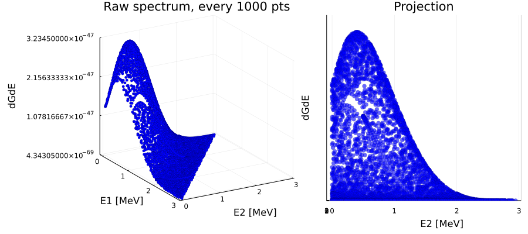

## Example of how to use the MPRebinSpectra module. 
### A discrete 2D spectrum of electron energies (for $2\nu\beta\beta$ decay) is given as an ascii text file where:
    column1 = E1, column2 = E2, column3 = multiplicity(dGdE)

The premise of MPRebinSpectra module is the use of segmential linear approximation of the discrete spectral points in order to transform the spectrum to a semi-continuous (subsequently continuous), normalized (to volume = 1) spectrum. Such spectrum can be saved as a new ascii file to use in further analysis (i.e. for sampling energies).  


```julia
using MPRebinSpectra, StatsPlots, FHist, CSV, DataFrames, ColorSchemes
Base.displaysize() = (5, 80) # this is just to show "only" 5 rows of dataframes
```


```julia
inFile = "spectrumG0.dat"
```


    "spectrumG0.dat"


### The MPRebinSpectra works with dataframes. The headers must be ```["E1", "E2", "dGdE"]``` (at some point I plan to change this, so that headers could be user-defined. 

#### Each column must contain only ```Float64``` variables. 


```julia
df_raw = CSV.File(inFile, delim = "    ", header = ["E1", "E2", "dGdE"]) |> DataFrame
df_raw.E1 = parse.(Float64, df_raw.E1)
df_raw.E2 = parse.(Float64, df_raw.E2);
```


```julia
df_raw
```


<div class="data-frame"><p>4,492,503 rows × 3 columns</p><table class="data-frame"><thead><tr><th></th><th>E1</th><th>E2</th><th>dGdE</th></tr><tr><th></th><th title="Float64">Float64</th><th title="Float64">Float64</th><th title="Float64">Float64</th></tr></thead><tbody><tr><th>1</th><td>0.00093</td><td>0.00093</td><td>1.34513e-47</td></tr><tr><th>2</th><td>0.00093</td><td>0.00193</td><td>1.34763e-47</td></tr><tr><th>3</th><td>0.00093</td><td>0.00293</td><td>1.35014e-47</td></tr><tr><th>4</th><td>0.00093</td><td>0.00393</td><td>1.35257e-47</td></tr><tr><th>5</th><td>0.00093</td><td>0.00493</td><td>1.35499e-47</td></tr><tr><th>&vellip;</th><td>&vellip;</td><td>&vellip;</td><td>&vellip;</td></tr></tbody></table></div>


```julia
p_raw = scatter(df_raw[1:1000:end, 1], df_raw[1:1000:end,2], df_raw[1:1000:end,3],
                zlims = (minimum(df_raw.dGdE), maximum(df_raw.dGdE)), legend = :false,
                xlabel = "E1 [MeV]", ylabel = "E2 [MeV]", zlabel = "dGdE", 
                title = "Raw spectrum, every 1000 pts", c = :blue, markeralpha = 1, ms = 2.5,
                markerstrokewidth = 0.2, camera = (55,45))
p_raw_side = scatter(df_raw[1:1000:end, 1], df_raw[1:1000:end,2], df_raw[1:1000:end,3],
                zlims = (minimum(df_raw.dGdE), 1.1*maximum(df_raw.dGdE)), legend = :false,
                 ylabel = "E2 [MeV]", zlabel = "dGdE", 
                title = "Projection", c = :blue, markeralpha = 0.6, ms = 4,
                markerstrokewidth = 0.2, camera = (90,0), zticks = :none)
plot(p_raw, p_raw_side, size = (900, 400), bottom_margin = 6Plots.mm, left_margin = 6Plots.mm)
```


    

    


----------------------------------------

### Rebinned dataframe contains columns:
    E1 - defines constant E1 for which the linear approximation of the spectral points was made
    minE - minimum energy E2 for the segment of the linear approximation 
    maxE - maximum energy E2 for the segment of the linear approximation (E1 of next row is E2 of previous - continuity)
    minG - dGdE value corresponding to minE 
    maxG - dGdE value corresponding to maxE (this will probably be deleted in future)
    a - approximation parameter from y = ax + b
    b - approximation parameter from y = ax + b
    
The argument ```_prec``` of ```rebin2D(df, _prec)``` is the precision with which the approximation is to be made. For example ```_prec = 0.001``` means that the approximation is made with an uncertainty of 1 promile. 

-------------------------------------------------------------------


```julia
df = rebin2D(df_raw, 0.001)
```


<div class="data-frame"><p>608,481 rows × 7 columns</p><table class="data-frame"><thead><tr><th></th><th>E1</th><th>minE</th><th>maxE</th><th>minG</th><th>maxG</th><th>a</th><th>b</th></tr><tr><th></th><th title="Float64">Float64</th><th title="Float64">Float64</th><th title="Float64">Float64</th><th title="Float64">Float64</th><th title="Float64">Float64</th><th title="Float64">Float64</th><th title="Float64">Float64</th></tr></thead><tbody><tr><th>1</th><td>0.00093</td><td>0.00093</td><td>0.01493</td><td>1.34513e-47</td><td>1.37867e-47</td><td>2.39571e-47</td><td>1.3429e-47</td></tr><tr><th>2</th><td>0.00093</td><td>0.01493</td><td>0.02693</td><td>1.37867e-47</td><td>1.40984e-47</td><td>2.5975e-47</td><td>1.33989e-47</td></tr><tr><th>3</th><td>0.00093</td><td>0.02693</td><td>0.04093</td><td>1.40984e-47</td><td>1.45085e-47</td><td>2.92929e-47</td><td>1.33095e-47</td></tr><tr><th>4</th><td>0.00093</td><td>0.04093</td><td>0.05893</td><td>1.45085e-47</td><td>1.50717e-47</td><td>3.12889e-47</td><td>1.32278e-47</td></tr><tr><th>5</th><td>0.00093</td><td>0.05893</td><td>0.10993</td><td>1.50717e-47</td><td>1.66716e-47</td><td>3.13706e-47</td><td>1.3223e-47</td></tr><tr><th>&vellip;</th><td>&vellip;</td><td>&vellip;</td><td>&vellip;</td><td>&vellip;</td><td>&vellip;</td><td>&vellip;</td><td>&vellip;</td></tr></tbody></table></div>


----------------------------

### ```normalize2D!(df)``` normalizes the dataframe to the total volume of 1. 

-----------------------------


```julia
df = normalize2D!(df)
```


<div class="data-frame"><p>608,481 rows × 7 columns</p><table class="data-frame"><thead><tr><th></th><th>E1</th><th>minE</th><th>maxE</th><th>minG</th><th>maxG</th><th>a</th><th>b</th></tr><tr><th></th><th title="Float64">Float64</th><th title="Float64">Float64</th><th title="Float64">Float64</th><th title="Float64">Float64</th><th title="Float64">Float64</th><th title="Float64">Float64</th><th title="Float64">Float64</th></tr></thead><tbody><tr><th>1</th><td>0.00093</td><td>0.00093</td><td>0.01493</td><td>0.402172</td><td>0.4122</td><td>0.71628</td><td>0.401506</td></tr><tr><th>2</th><td>0.00093</td><td>0.01493</td><td>0.02693</td><td>0.4122</td><td>0.42152</td><td>0.776611</td><td>0.400606</td></tr><tr><th>3</th><td>0.00093</td><td>0.02693</td><td>0.04093</td><td>0.42152</td><td>0.433781</td><td>0.87581</td><td>0.397934</td></tr><tr><th>4</th><td>0.00093</td><td>0.04093</td><td>0.05893</td><td>0.433781</td><td>0.45062</td><td>0.935488</td><td>0.395491</td></tr><tr><th>5</th><td>0.00093</td><td>0.05893</td><td>0.10993</td><td>0.45062</td><td>0.498454</td><td>0.937931</td><td>0.395348</td></tr><tr><th>&vellip;</th><td>&vellip;</td><td>&vellip;</td><td>&vellip;</td><td>&vellip;</td><td>&vellip;</td><td>&vellip;</td><td>&vellip;</td></tr></tbody></table></div>


### Approximated spectrum shown as lines build out of linear segments. Each line represents one constant E1


```julia
function plot_lines(step::Real, df::DataFrame, c::ColorPalette)
    p::Plots.Plot = plot()
    cp::Float64 = 1.0
    for e1 in 1:step:length(unique(df.E1))
        for row in eachrow(df[df.E1 .== unique(df.E1)[e1],:])
            xs = row.minE : 1e-3 : row.maxE
            line2(x) = get_line_point(x, row.a, row.b)
            plot!(xs, line2.(xs), lw = 2, alpha = 0.3, c = c[ceil(Int,cp)], legend = :false,
                    xlabel = "E2 [MeV]", ylabel ="dGdE", 
                    title = "projection of the linear approximations, \n every $step")
        end
        if cp < 250.0
            cp += step/10.0
        end

    end
    return p
end
```


    plot_lines (generic function with 4 methods)


```julia
c = palette(:thermal)

p = plot_lines(40, df[1:500_000,:], c)
p
```


    

    


### Output can be saved as a csv file which can be read off into new dataframe with ease


```julia
CSV.write("spectrumG0_Rebinned_prec0001.csv", df)
```


    "SpectrumG0_rebinned_1promile.csv"


